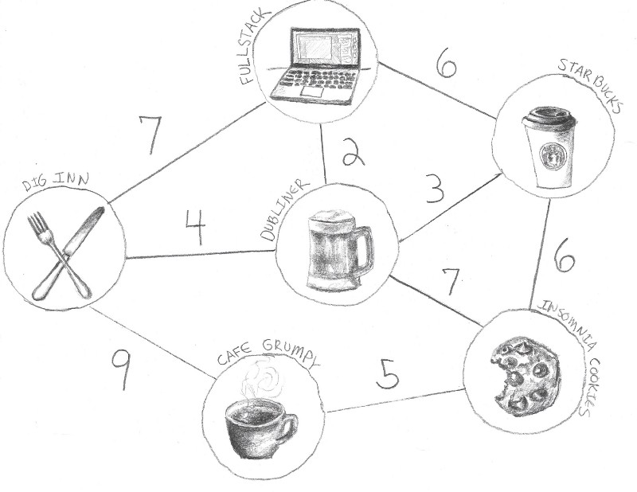

# shortest-path

This project derives shamelessly from the article [A Walkthrough of Dijkstra’s Algorithm (in JavaScript!)](https://medium.com/@adriennetjohnson/a-walkthrough-of-dijkstras-algorithm-in-javascript-e94b74192026) written by _**Adrienne Johnson**_.


The goal is to find the shortest path between 2 nodes in a given graph.

Let’s say we are at _Fullstack Academy_ in New York, and we want to know the shortest possible path to _Cafe Grumpy_ (see diagram). The weight of the edge between each node and its neighbors represents the distance it takes to walk from a node to the others.

The graph can be represented by a neighbors map. Each key in the neighbors list points to an array of edges extending from the node corresponding to the key. In a weighted graph, the neighbors list carries a second piece of information: the weight of each edge, or the cost of getting to that particular node. The numbers in red inside each node represent the node's ID which is an arbitrary integer value we give to each node in order to easily differentiate them. 



To represent this graph we choose to use a json definition with the following declarations:
```go
type jsonGraph struct {
	Nodes      []jsonNode       `json:"nodes"`
}

type jsonNode struct {
	Name       string           `json:"name"`
	Id         int              `json:"id"`
	Neighbors  []jsonNeighbors  `json:"neighbors"`
}

type jsonNeighbors struct {
	Id         int              `json:"id"`
	Weight     int              `json:"weight"`
}
```

and the data can be laid out as:
```json
{
    "nodes": [
        {
            "name": "Fullstack",
            "id": 0,
            "neighbors": [
                {
                    "id": 1,
                    "weight": 7
                },
                {
                    "id": 2,
                    "weight": 2
                },
                {
                    "id": 3,
                    "weight": 6
                }
            ]
        },
        {
            "name": "Dig Inn",
            "id": 1,
            "neighbors": [
                {
                    "id": 0,
                    "weight": 7
                },
                {
                    "id": 2,
                    "weight": 4
                },
                {
                    "id": 5,
                    "weight": 9
                }
            ]
        },
        {
            "name": "Dubliner",
            "id": 2,
            "neighbors": [
                {
                    "id": 0,
                    "weight": 2
                },
                {
                    "id": 1,
                    "weight": 4
                },
                {
                    "id": 3,
                    "weight": 3
                }
            ]
        },
        {
            "name": "Starbucks",
            "id": 3,
            "neighbors": [
                {
                    "id": 0,
                    "weight": 6
                },
                {
                    "id": 2,
                    "weight": 3
                },
                {
                    "id": 4,
                    "weight": 6
                }
            ]
        },
        {
            "name": "Cafe Grumpy",
            "id": 5,
            "neighbors": [
                {
                    "id": 1,
                    "weight": 9
                },
                {
                    "id": 4,
                    "weight": 5
                }
            ]
        },
        {
            "name": "Insomnia Cookies",
            "id": 4,
            "neighbors": [
                {
                    "id": 5,
                    "weight": 5
                },
                {
                    "id": 2,
                    "weight": 7
                },
                {
                    "id": 3,
                    "weight": 6
                }
            ]
        }
    ]
}
```

On the Go side of things, we will use the following data structures:
```go
type Edge struct {
  toNode  *Node
  weight  int
}

type Node struct {
  name string
  id    int
}

type Graph struct {
  nodes               map[int]*Node
  neighborsList       map[int][]Edge
}

```
To add a node to the graph, we push it into the collection of node values, which will help us iterate through them later, and we add a new entry in the neighbors list, setting its value to an empty array.

Create an empty graph
```go
func NewGraph() *Graph {
  neighbors := make(map[int][]Edge)
  nodes := make(map[int]*Node)
  return &Graph{nodes, neighbors}
}
```
Then from reading the graphdefinition.json file which contains the relationship between each node and their neighbors, we can build the graph using the buildGraph function.

The code is
```go
func main() {
  g := NewGraph()
  g.buildGraph("./graphdefinition.json")
  path, distance := g.findPathWithDijkstra(0, 5)
  fmt.Printf("Shortest Path from '%s' to '%s' is '%s' and distance is '%v'\n", g.nodes[0].name, g.nodes[5].name, path, distance)
}
```
Here we use nodeId 0 and 5, which according to our graphdefinition represent respectively the "fullstack" and "Cafe Grumpy" nodes. We find the value **14** which corresponds to the shortest possible distance.

_buildGraph_ is in charge of creating the data structure that holds the graph data. It uses 2 loops where in the first loop, the nodes map is populated. In the second loop, the relationships between nodes are entered using the neighborsList map.  

## The Dijkstra Approach

- Move to a node that has not been visited, choosing the closest node to get to first.
- At that node, check how far each of its neighboring nodes are. Add the neighbor’s weight to the distance it took to get to the node we’re currently on. Keep in mind that we’re calculating the distance to reach those nodes before we visit them.
- Check whether that calculated distance is shorter than the previously known shortest distance to get to that node. If it is shorter, update our records to reflect the new shortest distance. We’ll also add this node to our line of nodes to visit next. That line will be **arranged in order of shortest calculated distance** to reach.

By calculating and continually updating the shortest distance to reach each node on the graph, the algorithm compiles the shortest path to the endpoint.

Let’s try those steps out. Of all the nodes, we only know the distance it takes to get to one — Fullstack — because the distance is 0. It’s where we’re starting! From there, we check the neighboring nodes. We see that Dubliner has a weight of 2, and so we add that to the distance it took to get where we are, which is 0. We do the same for Starbucks and Dig Inn. Since these distances are shorter than any distance we previously knew, we record the distance it takes to get to these nodes as 2, 6, and 7, respectively, and we add them to our line of nodes to visit next. We also update our record of the last node we were on when we got to those now-shortest paths, adding an entry for each one and pointing them toward Fullstack. This is how we’ll trace our path back to where we started.

We move to another node, the one first up in our line. Right now that’s the Dubliner. Now, here’s where the algorithm starts to reveal its glory. If we check the neighboring nodes, we see that the distance it takes to get to Starbucks is 5. We got that by adding the distance it took us to to the Dubliner (2) plus the weight of the edge between the Dubliner and Starbucks (3). Now let’s check our records. The shortest distance we have on file for Starbucks is 6. Wait, that’s longer! We just found a faster route to Starbucks! Now we can update two sets of records: First, we update the shortest known distance to Starbucks. Then we update our parent trace, changing our entry for Starbucks to point to Dubliner — the node we were on when we found the shortest distance to reach it.

A key part of this approach is maintaining an ordered line of nodes to visit next. To set up that part of the algorithm, we’ll create a priority queue. A regular queue is first-in, first-out. A priority queue, however, doesn’t just place elements at the end of the line. It places them in order based on the weight each element has. Think of a regular queue as a grocery store line and a priority queue as the intake of an emergency room. Our priority queue will use 2 methods: _**Insert**_ that will place a new element in the queue based on its priority (here the distance), and _**DequeueFirst**_ that removes the first element (the highest priority) from the queue and returns it.

## The Algorithm

We’ll start by creating objects to hold our record of the shortest known distances and the steps we took. And we’ll initialize our priority queue:

```go
func (g *Graph) findPathWithDijkstra(startNodeID, endNodeID int) (string, int) {

	distances := make(map[int]int)
	parent := make(map[int]int)
	visited := make(map[int]int)
	pq := NewPqueue()
```

At the start, all we know is the shortest distance it takes to get to our start node. The shortest distance it takes to reach the others could be anything, so we’ll initialize those distances to MAXINT.

```go
	// initialize the distance of the source node as 0
	distances[startNodeID] = 0

	// and the other distances to MAXINT
	for _, v := range g.nodes {
		if v.id != startNodeID {
			distances[v.id] = MAXINT
		}
	}
```

We add our starting node to the priority queue to get things kicked off.

```go
	pq.Insert(g.nodes[startNodeID], 0)
```

And now we can really get rolling! We access the first element in the queue and start checking its neighbors, which we find using the neighbor list we made at the very beginning when we built the graph. We add the neighbor’s weight to the distance it takes to get to the node we’re on.


```go
	for !pq.isEmpty() {
		shortestStep := pq.DequeueFirst()
		currentNode := shortestStep.node
		visited[currentNode.id] = 1

		for _, neighbor := range g.neighborsList[currentNode.id] {
			if _, ok := visited[neighbor.toNode.id]; !ok {			
```
Then if we haven't visited that node yet, we check if the calculated distance is less than the distance we currently have on file for this neighbor. If it is, then we update our distances, we add this step to our parent map, and we add the neighbor to our priority queue!

```go
				newDistance := distances[currentNode.id] + neighbor.weight

				// Then we check if the calculated distance is less than the
				// distance we currently have on file for this neighbor. If it is,
				// then we update our distances, we add this step to our parent,
				// and we add the neighbor to our priority queue!
				if newDistance < distances[neighbor.toNode.id] {
					distances[neighbor.toNode.id] = newDistance
					parent[neighbor.toNode.id] = currentNode.id
					pq.Insert(neighbor.toNode, newDistance)
				}
			}
		}
	}
```

Now we can leave the algorithm to do its work. Once it reaches the end of our queue, all we have to do is look through our parent map to find the steps that will lead us to Cafe Grumpy. We can look up Cafe Grumpy in our distances map to find out just how far it will take to get there, knowing that it’s the shortest route.

```go
	// Once the end of our queue has been reached, all we have to do
	// is look through our parent map to find the steps that lead to 
	// the target node. We can look up target node in our 'distances'
	// map to find out just how long it will take to get there, knowing 
	// that it’s the quickest route.

	lastStep := g.nodes[endNodeID]
	output := ""

	for lastStep.id != startNodeID {
		output = fmt.Sprintf("> %v ", lastStep.name) + output
		lastStep = g.nodes[parent[lastStep.id]]
	}
	output = fmt.Sprintf("%v ", g.nodes[startNodeID].name) + output

	// that's it
	return output, distances[endNodeID]
}
```

There you have it! The shortest path is to take Dubliner to Insomnia Cookies to Cafe Grumpy, in 14 minutes.
