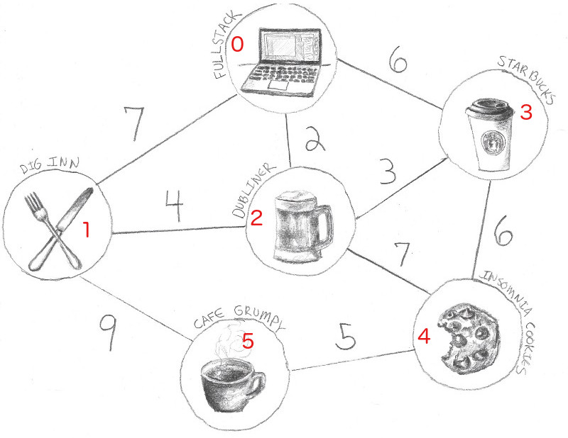

# shortest-path

This project derives shamelessly from the article [A Walkthrough of Dijkstra’s Algorithm (in JavaScript!)](https://medium.com/@adriennetjohnson/a-walkthrough-of-dijkstras-algorithm-in-javascript-e94b74192026) written by _**Adrienne Johnson**_.


The goal is to find the shortest path between 2 nodes in a given graph.

Let’s say we are at _Fullstack Academy_ in New York, and we want to know the shortest possible path to _Cafe Grumpy_ (see diagram). The weight of the edge between each node and its neighbors represents the distance it takes to walk from a node to the others.

The graph can be represented by a neighbors map. Each key in the neighbors list points to an array of edges extending from the node corresponding to the key. In a weighted graph, the neighbors list carries a second piece of information: the weight of each edge, or the cost of getting to that particular node. The numbers in red inside each node represent the node's ID which is an arbitrary integer value we give to each node in order to easily differentiate them. 



To represent this graph we choose to use a json definition with the following declarations:
```go
type jsonGraph struct {
	Nodes      []jsonNode       `json:"nodes"`
}

type jsonNode struct {
	Name       string           `json:"name"`
	Id         int              `json:"id"`
	Neighbors  []jsonNeighbors  `json:"neighbors"`
}

type jsonNeighbors struct {
	Id         int              `json:"id"`
	Weight     int              `json:"weight"`
}
```

and the data can be laid out as:
```json
{
    "nodes": [
        {
            "name": "Fullstack",
            "id": 0,
            "neighbors": [
                {
                    "id": 1,
                    "weight": 7
                },
                {
                    "id": 2,
                    "weight": 2
                },
                {
                    "id": 3,
                    "weight": 6
                }
            ]
        },
        {
            "name": "Dig Inn",
            "id": 1,
            "neighbors": [
                {
                    "id": 0,
                    "weight": 7
                },
                {
                    "id": 2,
                    "weight": 4
                },
                {
                    "id": 5,
                    "weight": 9
                }
            ]
        },
        {
            "name": "Dubliner",
            "id": 2,
            "neighbors": [
                {
                    "id": 0,
                    "weight": 2
                },
                {
                    "id": 1,
                    "weight": 4
                },
                {
                    "id": 3,
                    "weight": 3
                }
            ]
        },
        {
            "name": "Starbucks",
            "id": 3,
            "neighbors": [
                {
                    "id": 0,
                    "weight": 6
                },
                {
                    "id": 2,
                    "weight": 3
                },
                {
                    "id": 4,
                    "weight": 6
                }
            ]
        },
        {
            "name": "Cafe Grumpy",
            "id": 5,
            "neighbors": [
                {
                    "id": 1,
                    "weight": 9
                },
                {
                    "id": 4,
                    "weight": 5
                }
            ]
        },
        {
            "name": "Insomnia Cookies",
            "id": 4,
            "neighbors": [
                {
                    "id": 5,
                    "weight": 5
                },
                {
                    "id": 2,
                    "weight": 7
                },
                {
                    "id": 3,
                    "weight": 6
                }
            ]
        }
    ]
}
```

On the Go side of things, we will use the following data structures:
```go
type Edge struct {
  toNode  *Node
  weight  int
}

type Node struct {
  name string
  id    int
}

type Graph struct {
  nodes               map[int]*Node
  neighborsList       map[int][]Edge
}

```
To add a node to the graph, we push it into the collection of node values, which will help us iterate through them later, and we add a new entry in the neighbors list, setting its value to an empty array.

Create an empty graph
```go
func NewGraph() *Graph {
  neighbors := make(map[int][]Edge)
  nodes := make(map[int]*Node)
  return &Graph{nodes, neighbors}
}
```
Then from reading the graphdefinition.json file which contains the relationship between each node and their neighbors, we can build the graph using the buildGraph function.

The code is
```go
func main() {
  g := NewGraph()
  g.buildGraph("./graphdefinition.json")
  path, distance := g.findPathWithDijkstra(0, 5)
  fmt.Printf("Shortest Path from '%s' to '%s' is '%s' and distance is '%v'\n", g.nodes[0].name, g.nodes[5].name, path, distance)
}
```
Here we use nodeId 0 and 5, which according to our graphdefinition represent respectively the "fullstack" and "Cafe Grumpy" nodes. We find the value **14** which corresponds to the shortest possible distance.

_buildGraph_ is in charge of creating the data structure that holds the graph data. It uses 2 loops where in the first loop, the nodes map is populated. In the second loop, the relationships between nodes are entered using the neighborsList map.  

## The Dijkstra Approach

- Move to a node that has not been visited, choosing the closest node to get to first.
- At that node, check how far each of its neighboring nodes are. Add the neighbor’s weight to the distance it took to get to the node we’re currently on. Keep in mind that we’re calculating the distance to reach those nodes before we visit them.
- Check whether that calculated distance is shorter than the previously known shortest distance to get to that node. If it is shorter, update our records to reflect the new shortest distance. We’ll also add this node to our line of nodes to visit next. That line will be arranged in order of shortest calculated distance to reach.

By calculating and continually updating the shortest distance to reach each node on the graph, the algorithm compiles the shortest path to the endpoint.

